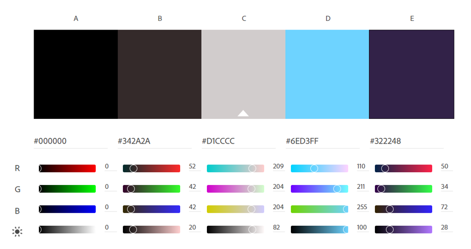

# "About Me" Website Project
## By: Alex O'Neill

_________________________________________________________________________________

## Netlify Status Badge:

[][def]
[def]: https://app.netlify.com/sites/about-me-ao-g00298371/deploys

__________________________________________________________________________________

## Project Documentation:

### "Site Designer" and "Personal Facts" Sections:

The first part of my project that I built were the "Site Designer" and "Personal Facts" (formerly "Quick Facts/Hobbies") sections. Being that I was a first-time web designer and had no idea what I was doing, these sections were seminal to my understanding of basic HTML and soon later, basic CSS.

#### Logo:

### "Gallery" Section:

This section was personally a challenge for me because up to this point, I was unfamiliar with styling images in CSS. Around the time I made this section was also when I added color to my website and styled my all of my headers/subheaders.

### "Blog Topic" Section:

This section started out originally as a meaningless "litipsum" article, but has turned into so much more. It was originally created so that I could properly visualize and modify my media states, but recently I've added my own "Blog Post" summarizing the usage and arguing for the usefulness of variable fonts a typographical asset.

#### "Blog Topic" Sources:

[•	"Variable fonts: An introduction" by Steve Matteson.][def2]
[def2]: https://www.typenetwork.com/news/variable-fonts-an-introduction

[•	"How to use variable fonts on the web" by Zach Leatherman.][def3]
[def3]: https://www.zachleat.com/web/about/

[•	"Variable fonts: The future of typography on the web" by Rachel Andrew.][def4]
[def4]: https://www.smashingmagazine.com/2017/05/variable-fonts-future-typography-web/

### "Original Video" iFrame Section:

This section is meant to showcase my knowledge of configuring iFrames and using them to link YouTube videos and other outside sources on the internet for use on my website.

### "Feedback Form" Section:

The feedback/contact form on my website was one of the biggest challenges of designing my website, as it took several hours to style and fit it in with my responsive design. If you'd like to provide me with feedback on my work, please consult the form in this section. 

### Navigation Bar:

The navigation bar at the top of my website was the second hardest part of my website to configure, especially given its relation to the header and my makeshift logo at the top of the page. When you switch from a laptop view to a smaller media state, the Nav Bar will collapse into a hamburger menu icon, which can be toggled on and off to expose the hidden navigation bar.

___________________________________________________________________________________

## Color Palette:

For the color palette of my project, the far background was solid black (#ffffff). For the header, subheaders, dropcaps, and select elements of the project, I used the color #6ed3ff, which is a light blue color that has been adjusted to have all of the brightness of the default teal color linked in CSS and yet none of the jarring effect on the eyes. To create contrast in the background of certain sections, I used rgb(42, 42, 61), which is a dark blueish-gray color that pairs nicely with my light blue. For the background of my video section and the site designer section, I used #201b3f; which is a dark purple, almost indigo color. Finally, for the bulk of my paragraph and informative text, I used #d1cccc, which is a very light gray, keeping a good contrast with the dark background.

## Original Color Palette:

___________________________________________________________________________________

## License

 This work is licensed under a <a rel="license" href="http://creativecommons.org/licenses/by/4.0/">Creative Commons Attribution 4.0 International License</a>.

